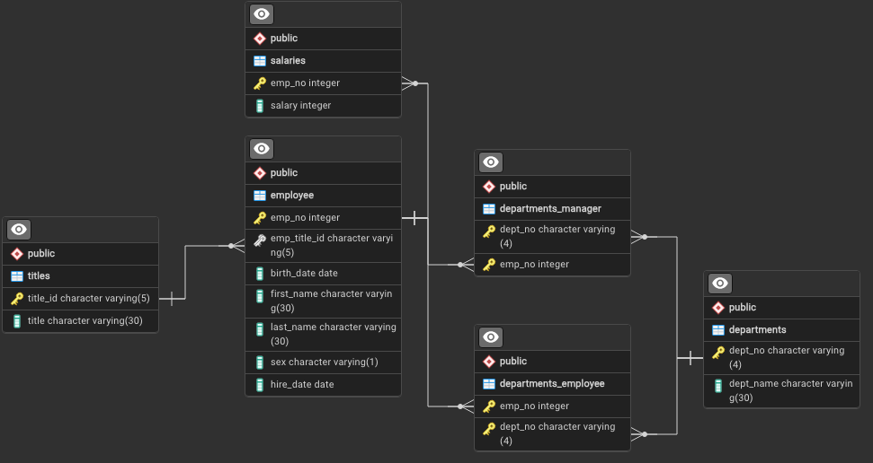
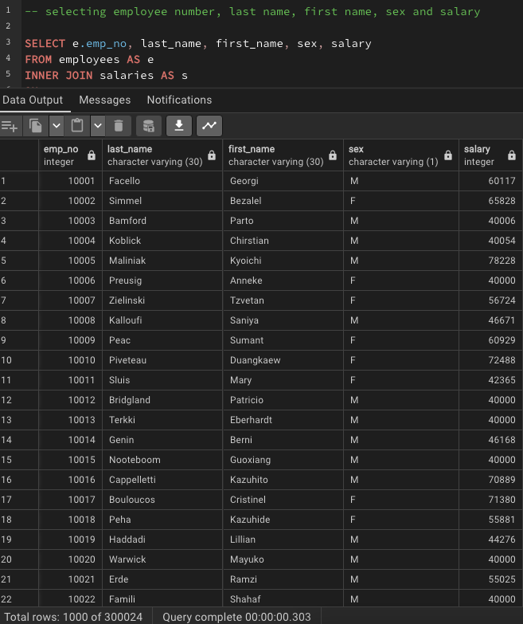
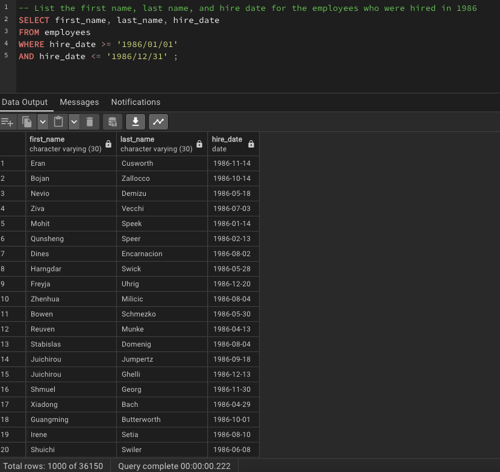
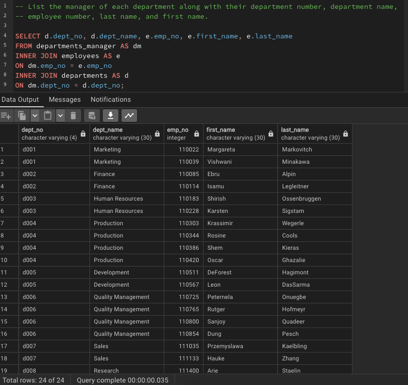
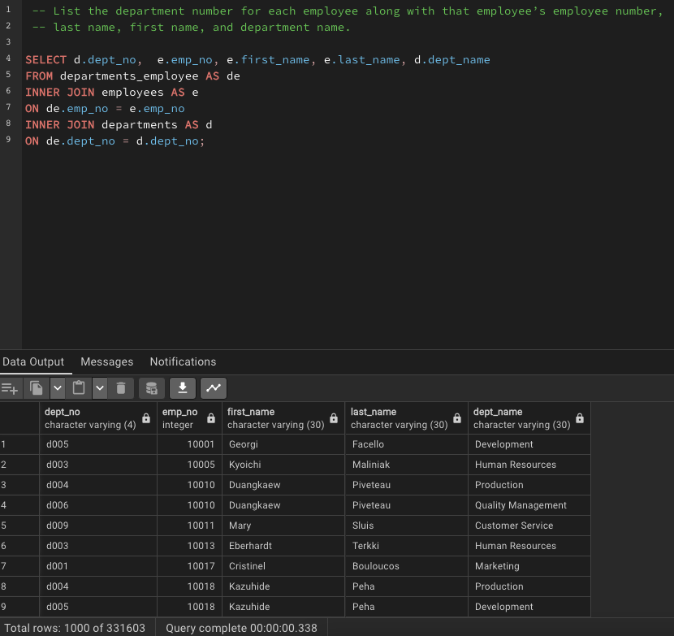
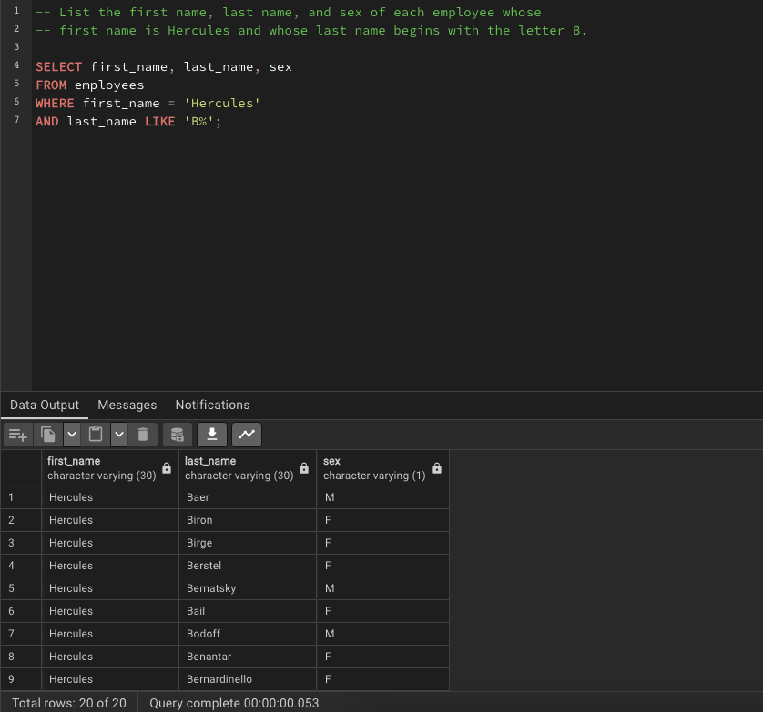
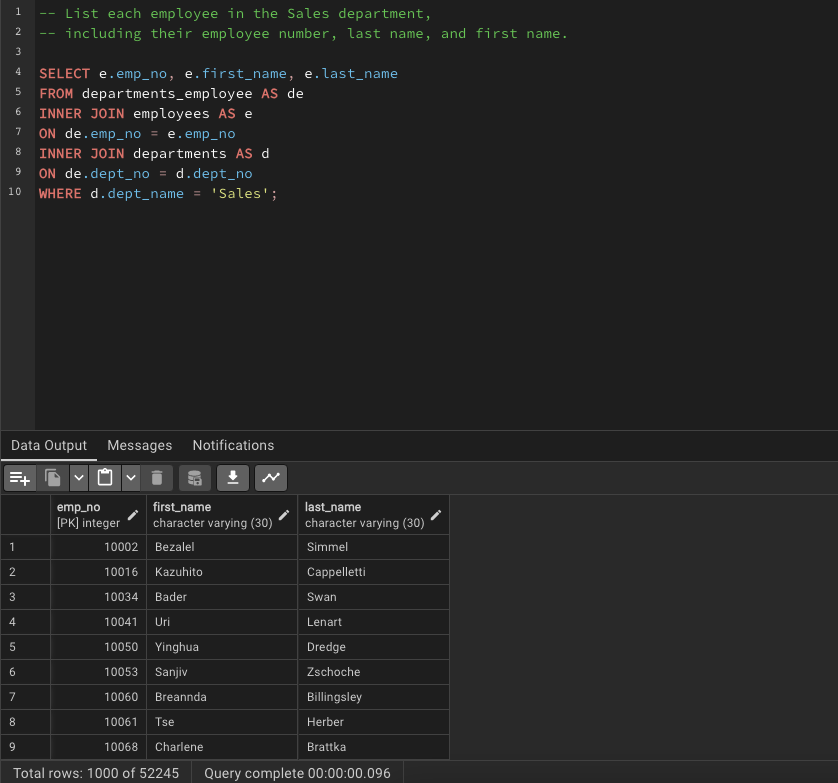
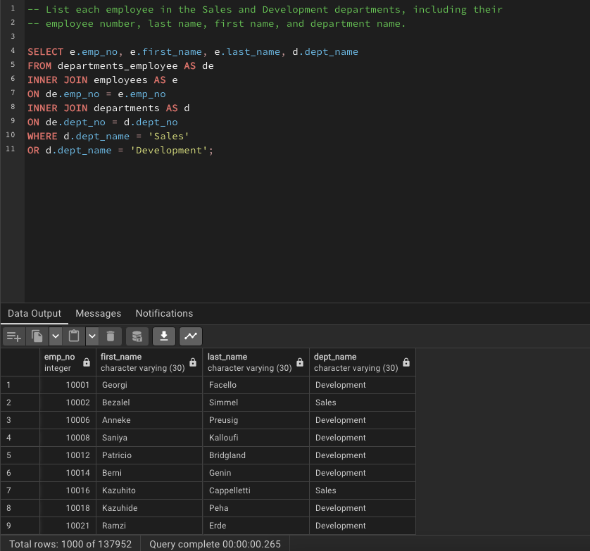
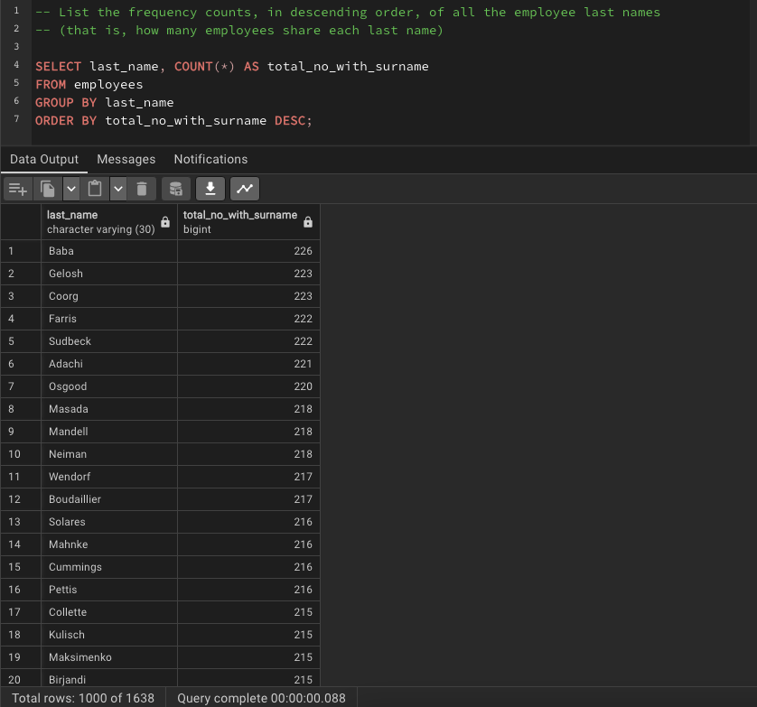

# sql-challenge
Bootcamp Module 9 homework on SQL

# The Problem Set Scenario

It’s been two weeks since you were hired as a new data engineer at Pewlett Hackard (a fictional company). Your first major task is to do a research project about people whom the company employed during the 1980s and 1990s. All that remains of the employee database from that period are six CSV files.

For this project, you’ll design the tables to hold the data from the CSV files, import the CSV files into a SQL database, and then answer questions about the data. That is, you’ll perform data modelling, data engineering, and data analysis, respectively.

## Requirements
This problem set was completed using PostgreSQL 16 and pgAdmin4 v8.2.

# Solutions

## File Locations

The following locations contain the various parts of this assignment:

- Input data for tables in `/EmployeeSQL/data/`
- Entity Relationship Diagram (ERD) in `/EmployeeSQL/images/`
- The database schema is found with `/EmployeeSQL/schema.sql`
- The 8 queries are located in separate files in `/EmployeeSQL/queries/`
- Snapshots of the 8 query outputs are located in `/EmployeeSQL/images/`

## Data Engineering
The below Entity Relationship Diagram (ERD) illustrates one solution to organise the employee records for Pewlett Hackard. The ERD was created in pgAdmin4 and the creation file is `EmployeeSQL/ERD_employee.pgerd`.

It should be noted that the salaries table has a one-to-one relationship with the employees table. These two tables could potentially be merged so salary could fit in employee.

We have two junction tables that facilitate many-to-many relationship with the employees-department. The two junction tables are used to:
1.  List all employees in each department
2.  List all managers for each department
   

## Data Analysis
1. List the employee number, last name, first name, sex, and salary of each employee. 
    
    See `/EmployeeSQL/queries/q01.sql`

2. List the first name, last name, and hire date for the employees who were hired in 1986.
   
    See `/EmployeeSQL/queries/q02.sql`

3. List the manager of each department along with their department number, department name, employee number, last name, and first name.

    See `/EmployeeSQL/queries/q03.sql`

4. List the department number for each employee along with that employee’s employee number, last name, first name, and department name.

    See `/EmployeeSQL/queries/q04.sql`

5. List the first name, last name, and sex of each employee whose first name is Hercules and whose last name begins with the letter B.

    See `/EmployeeSQL/queries/q05.sql`

6. List each employee in the Sales department, including their employee number, last name, and first name.

    See `/EmployeeSQL/queries/q06.sql`

7. List each employee in the Sales and Development departments, including their employee number, last name, first name, and department name.

    See `/EmployeeSQL/queries/q07.sql`

8. List the frequency counts, in descending order, of all the employee last names (that is, how many employees share each last name).

    See `/EmployeeSQL/queries/q08.sql`

